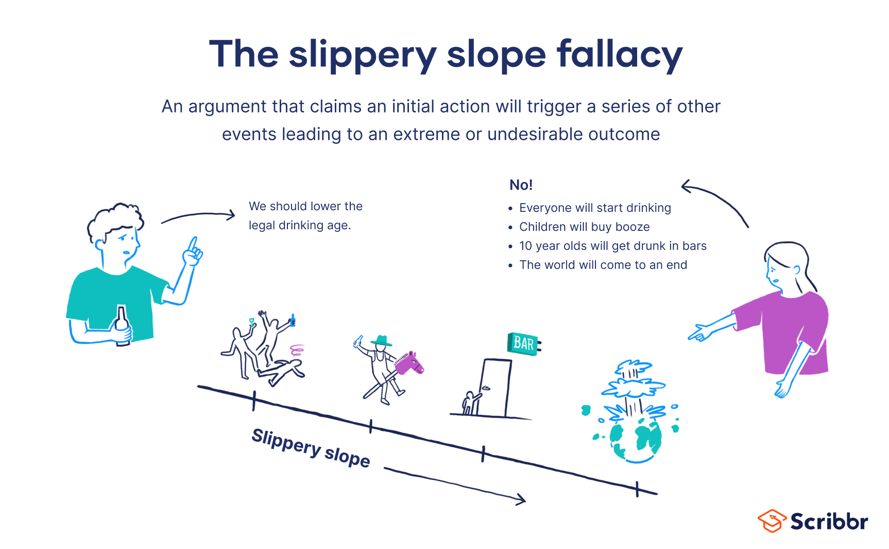
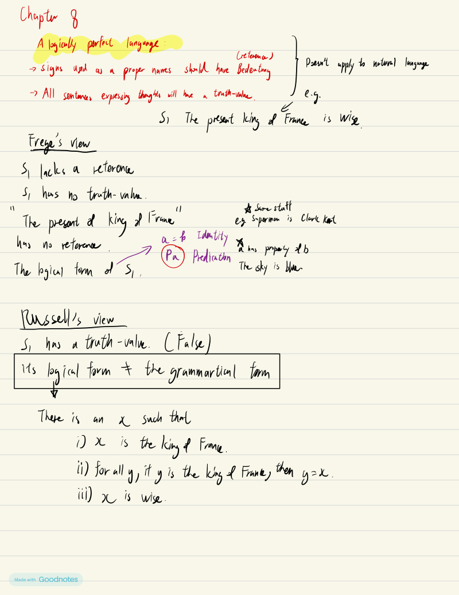

# ePortfolio：2025年9月30日 - HUMA1710 講座：語言的陷阱（從含混的謬誤開始）

今堂lecture繼續探討「語言的陷阱」，重點置於含混所引致的謬誤，以及著色字詞與訴諸憐憫等概念。講座從連續體謬誤起始，先前投影片（歧義部分）已略過。本條目將展示並討論今日學習的重大體驗，連結至指定閱讀材料（「2b. The Pitfalls of Language.pdf」，頁15-19）、新聞文章，以及對批判性思維成長的反思。

#### 重大體驗一：連續體謬誤

依據閱讀材料（PDF第15頁），連續體謬誤利用語詞含混性質，將可粗略區分的事物視為不可區分。例如「有錢人與窮人沒有大分別」（因財富為連續體，無明確界線），或「我和拿A-的室友差不多」（成績為漸變尺度）。

反思： 那如果是有錢人與窮人沒有大分別，因為皆為人……惟實際上，此忽略了量化差異在現實中的重要性。

反思：此謬誤令我意識到語言含混可誤導判斷。昔日我偶爾採用類似思維，如「所有飲食法大致相同」因體重變化漸進，然今知此阻礙精準分析。此有助提升辨識論證模糊邊界的技能，強化批判性思維能力。成就：現能於日常辯論中辨識此點，如政策討論中模糊「富貧」以迴避稅務改革。

#### 重大體驗二：滑坡謬誤

閱讀材料（PDF第16頁）：滑坡謬誤表現為環環相扣的因果關係，惟各環節僅為「可能」而非「必然」。例如「同意主動安樂死→被動安樂死→草菅人命」，或「大學生上莊→無暇學習→無實習經驗→找不到工作」。

註記：僅A→B不構成滑坡謬誤（如「小時偷針，大時偷金」或為草率概括），須有多重薄弱連結。

資料一：近期香港新聞 - 同性伴侶登記草案遭否決。連結：[https://www.hk01.com/article/60275148](https://www.hk01.com/article/60275148)

依據文章摘要：立法會以71票反對、14票贊成、1票棄權否決草案，為近年首度推翻政府法案。選委界何君堯強烈反對，稱「有人行緊康莊大道唔走，跌入歧途……世界調轉，你同佢一齊迷失！」彼警告草案將觸發連鎖反應：允許登記→同性婚姻合法化→社會矛盾如歐美（例如「幼稚園就要教男男女女，下一代點算？」），甚至影響生育率或家庭價值。彼敦促局長「勇敢站起來，將終院不合適裁斷直接取締！」，稱之為「庸人自擾，為一小撮人令全社會承受後果！」。

分析：此明顯為滑坡謬誤，因從簡單登記（A）→繼而同性婚姻合法化（B）→導致幼稚園教育變革（C）→全社會受苦（D），惟各連結僅為「可能」而無必然證據。先不論同性婚姻之正誤，何君堯推論假設最壞連鎖而無佐證，為典型謬誤。

為視覺化：

（此插圖展示滑坡謬誤為連鎖導向災難，有助解釋概念。）

反思：接觸此新聞令我應用課程材料於即時事件，提升剖析政治修辭的能力。成長：現能質疑辯論中「若則」連鎖，如香港政壇，避免受誤導。成就：此建構非黨派分析能力，符合課程追求真理之目標。

額外視覺輔助：

.png)

.png)

---

#### 重大體驗三：著色字詞

閱讀材料（PDF第17-18頁）：著色字詞攜帶情感負荷，例如「堅定」對比「固執」、「公僕」對比「公務員」，或「參考」對比「抄襲」。其可隨時間變化（如「鬼佬」），並依上下文而定。

堂上討論：誰判斷著色字詞是否冒犯？本人初以為為說話者意圖 - 若無害意，則非冒犯，因字詞中性，用法關鍵。惟課堂民調顯示多數人選聽者感知。

為尋答案，研究顯示：判斷依上下文而定，包括說話者意圖，但最終往往由聽眾或受眾決定，基於文化、情境及感知意義。縱說話者無意，若聽者因歷史或權力動態而感傷害，則可視為冒犯。非黑白二分，惟感知常凌駕意圖於社會判斷。

反思：此轉變我從僅在意圖至整體情境之觀點，有助溝通能力。成長：現更注重字詞選擇，避免無意傷害。成就：應用於日常互動，如小組項目，提升包容語言運用。

#### 重大體驗四：訴諸憐憫

閱讀材料（PDF第19頁）：訴諸憐憫為訴諸情感之子類，利用憐憫而非證據。例如兇手求情「我是孤兒」（惟其殺害父母），或學生作弊後稱「讓我及格，否則求職困難」。繞過邏輯以情感操縱。

反思：個人認為「可恥但有用」，因人類情感使然。惟學習此提醒我堅持事實於論證中。成長：增強抵抗廣告或政治操縱術的能力。成就：現能辨識並反駁此於現實，如過度依賴悲情故事而無數據之募捐呼籲。

# ePortfolio：語言的陷阱模塊反思 - 25/9

### 語言陷阱模塊之反思 (The Pitfalls of Language Module Reflection)

本模塊探討語言如何誤導我哋嘅思維。我將展示並分析與本模塊相關嘅重要經歷，包括課堂筆記、PDF附件以及幻燈片截圖。呢啲artefacts均與我在課程中培養批判性思維嘅過程息息相關，顯著提升咗我辨識語言陷阱嘅能力。透過深入反思，我將闡述呢啲材料如何證明我嘅進步、技能發展同學習成就。本部分採用繁體中文撰寫，適度融入廣東話表達，以確保語感自然流暢。

#### 1. 模塊概述與Artefacts展示

本模塊聚焦語言嘅陷阱，涵蓋歧義(Ambiguity)、含混(Vagueness)、著色字詞(Coloured Word)及言辭空廢(Empty Verbalism)等現象。我附上咗之前學嘅huma 1922寫嘅notes PDF“ch8.pdf”,探討了logically perfect language，介紹Frege同Russell嘅理論，解釋如何利用邏輯形式規避語言歧義問題。兩者均闡明咗日常語言歧義嘅解決之道。

手寫筆記記錄咗Russell同Straw-son嘅觀點，例如Russell認為「The present King of France is wise」嘅邏輯形式為false，因無實際指涉；Strawson則認為該句無truth-value，因其presupposition不成立。筆記中嘅圈圈同箭頭顯示咗我喺課堂後嘅積極參與同深入分析。

[View PDF](M3.assets/ch8_compressed.pdf)

#### 2. 重要學習經歷探討

喺本模塊，我領悟到語言不僅係溝通工具，更可能誤導思維。以歧義為例，nam sai lok提到香港新聞案例，如「兒子生性病母倍感安慰」，令我想起類似笑話，如「大馬羽球賽李宗偉奪冠，馬國明放假一天」。呢類ambiguity令句子產生雙重解釋，既幽默又易生誤解。呢段經歷讓我明白日常語言如何喺新聞或廣告中引發誤會。

**歧義性謬誤**：PDF第7-9頁提到歧義嘅好處（如文學創作，例如「因荷而得藕，有杏不須梅」）與壞處（混淆思維）。例如「下雨天留客天留我不留」，視乎斷句可解為「下雨天留客，天留我不留」或「下雨天留客天，留我不留」，顯示文言文常見問題——that’s why nobody uses it nowadays，因其易生歧義。呢點啟發我反思古文如何影響現代溝通，增強咗我分析句構嘅能力。

**模稜兩可謬誤 (Equivocation)**：例如「爭取自由最終徒勞無功，因人生總受約束」，犯咗邏輯錯誤，因「自由」喺政治自由同絕對無約束間偷換概念，而且使用類似的概念可以引申出「每天吃飯最終徒勞無功，因為人總會肚餓。」，顯得原句特別荒謬。另一例：「有室友勝過無任何東西；無任何東西勝過有女/男朋友，因此有室友勝過有女/男朋友。」轉為其他形式表達：室友 > nothing, 男女朋友 > anything ，無法得出室友>男女朋友，邏輯明顯不通。呢段經歷教我利用邏輯公式檢視論點，證明我在批判性思維上嘅進步。

**語氣加重 (Accent)**：PDF第12頁舉例「沒有！我們今天沒有偷懶！」，強調「今天」暗示其他日子或有偷懶。呢點讓我意識到語調如何改變語意，尤其喺廣東話口語中極為常見。

**含混 (Vagueness)**：PDF第13-14頁提到詞彙如「高矮、貧富」難以精確界定，例如「大聲啲」——究竟多大聲？主觀性強。含混雖具彈性，但易被用於製造空話，法例制定時尤需避免。連續體謬誤如「有錢人與窮人無大分別」，滑坡謬誤如「同意安樂死等同草菅人命」。呢段經歷提升咗我喺辯論中辨識模糊論點嘅competency。

**著色字詞 (Coloured Word)**：PDF第17-19頁提到詞彙如「堅定/固執」因情感而改變語意。例如「參考/抄襲」描述同一行為，卻因情緒不同而用詞有異。訴諸憐憫例子如學生求情「老師請讓我合格，否則搵工好難」。呢點教我避免情感操縱，增強咗客觀討論嘅能力。

**言辭空廢 (Empty Verbalism)**：PDF第20-24頁區分絕對空廢（如「做生意就是做生意」）同相對空廢（如算命師「父在母先亡」）。呢段學習讓我掌握分辨空洞陳述嘅技巧，提升識別假資訊嘅成就。

#### 3. 深刻反思：成長、技能與成就

本模塊不僅教我辨識語言陷阱，更與其他模塊（如邏輯推理、批判性思維）緊密相連，涵蓋至少五個核心範疇（語言陷阱、邏輯形式、批判思維、情感謬誤、言辭分析）。透過artefacts如PDF同筆記，我見證自己從最初只是對語言歧義(貌似CORE 1901有教過，又是nam sai lok教的呢)有一點模糊的認知，進展到能運用Russell理論分析句子邏輯形式（例如「The present King of France is wise」轉為：存在唯一x為法國國王，且x wise，若無x則false）。

成就方面，我而家能將呢啲技能應用於日常，例如閱讀新聞時檢查歧義，避免被政治宣傳誤導（如「公僕/公務員」嘅著色詞）。本模塊令我喺討論中更自信，證明課程助我accomplish更佳嘅思維習慣。

---
**日期：2025 年 10 月 9 日**
**主題：意義、內涵與外延——從語言哲學到認知意義判準**

---

### 一、今日核心概念回顧

#### 1. **內涵與外延**

- **內涵**：詞語的定義、概念內容（intension）
- **外延**：詞語所指的具體對象集合（extension）
- 原則上：「內涵固定則外延固定」，但若內涵改變，外延也會隨之改變。

#### 2. **行星例子：9 → 8 是否推翻原則？**

- 不推翻。因為 IAU 在 2006 年**修改了「行星」的定義（內涵）**，導致外延從 9 個變為 8 個。
- 這恰恰印證「內涵固定則外延固定」：內涵變，外延也變。

#### 3. **有沒有「沒有內涵」的詞語？**

- 哲學家如密爾、克里普克認為**專有名詞**（如“亞里士多德”）只有外延，沒有內涵。
- 但 Professor 提出一個深刻觀點：**一旦說某詞「沒有內涵」，就已經賦予它一個內涵**，形成一種悖論（paradox）。
- 他舉例 AI 生成圖像：任何被創作的東西，一旦被指認，就已具備某種內涵。
- 這顯示他傾向認同 **Frege** 的觀點：所有詞語都有某種「含義」。

---

### 二、與課程材料《意義判準》的連結

#### 1. **認知意義與真值**

- 語句必須能判斷真假，才具備**認知意義**。
- 區分：
    - **分析述句**：僅由語言分析即可判斷真假（如恆真句、矛盾句）
    - **綜合述句**：需依賴經驗事實判斷真假

#### 2. **四種驗證原則**

| **原則** | **判斷標準**    | **例子**      |
| ------ | ----------- | ----------- |
| 檢證原則   | 可否由經驗證明為真   | 「有一隻天鵝是白色的」 |
| 印證原則   | 可否被經驗證據支持為真 | 「所有天鵝都是白色的」 |
| 否證原則   | 可否由經驗證明為假   | 「所有天鵝都是白色的」 |
| 非證原則   | 可否被經驗證據支持為假 | 「有一隻天鵝是黑色的」 |

#### 3. **非認知意義的價值**

- 不具認知意義的語句，仍可能具備：
    - 規範意義（如孟子性善論）
    - 情感意義（如詩詞）
    - 美學意義（如文學描寫）

---

### 三、個人反思

- 今天討論的「內涵與外延」不只是語言遊戲，而是**理解科學定義變遷、語詞本質**的關鍵工具。
- Professor 所說的「說一個詞沒有內涵，就已賦予它內涵」，讓我意識到語言具有自我指涉的特性，這與邏輯悖論、後設語言等議題密切相關。
- 這也呼應了 Frege 對「含義」的重視：語言不只是標記，而是承載概念的媒介。
- 在未來學習中，我希望進一步探討：
    - 人工智慧生成內容（如 AI 圖像）是否具有「內涵」？
    - 科學理論的修正（如行星定義）如何反映語言與現實的互動？

---

### 四、關鍵詞彙整理

- 內涵 / 外延
- 認知意義 / 非認知意義
- 分析述句 / 綜合述句
- 檢證 / 印證 / 否證 / 非證原則
- 專有名詞與嚴格指示詞
- Frege 與克里普克的語意理論

